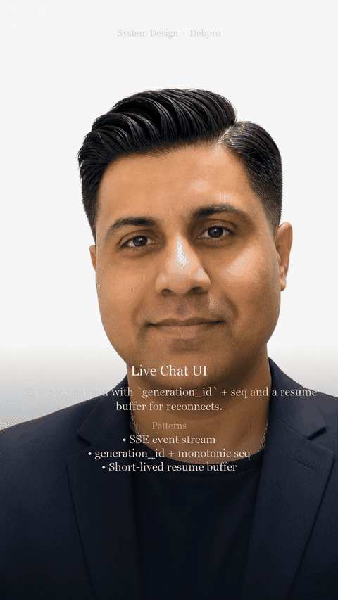

# Use Case: Live Chat UI

**YouTube walkthrough:** [Live Chat Ui — System Design #Shorts](https://youtu.be/H9afr17REVc)

**Design doc:** [docs/DESIGN.md](./docs/DESIGN.md) — architecture, patterns, and why.


**Parent system design:** [02 — Streaming Token Delivery](../02-streaming-token-delivery.md)  
**Also references:** [10 — Global realtime product](../10-global-realtime-product-surface.md)

## Users & problem

End users watch tokens appear in a chat bubble. Network blips, tab refreshes, and slow mobiles must not corrupt the turn or freeze the spinner forever.

## Requirements & SLOs

| Requirement | Target |
|-------------|--------|
| TTFT feel | ≤ 500 ms to first painted token |
| Reconnect | Resume within ~1–2 s of tokens |
| Cancel / stop | Immediate client cancel → server abort |
| Ordering | Strict seq within a turn |

## Design (from parent)

```
Chat client (SSE) → Stream gateway → Generation orchestrator
  → Inference → sequenced token events
  → Ring buffer for resume → durable finalize in conversation store
```

Reuse: `generation_id` + `seq`, SSE default, backpressure that protects GPUs, idempotent finalize.

## Specializations

| Concern | Chat UI choice |
|---------|----------------|
| Protocol | SSE over HTTP/2; disable proxy buffering |
| UX | Optimistic user message; streaming assistant placeholder |
| Multi-device | Sync via conversation seq ([10](../10-global-realtime-product-surface.md)) |
| Safety | Mid-stream interrupt events ([06](../06-safety-moderation-pipeline.md)) |

## Failure modes

- Stuck spinner → client + server idle timeouts; surface error with retry.
- Double submit → `idempotency_key` on user turn.
- Slow mobile → buffer then disconnect with resume token; don’t block GPU.


## Design walkthrough (opens on GitHub)

> **Watch on YouTube:** [Live Chat Ui — System Design #Shorts](https://youtu.be/H9afr17REVc)




Full narrated video (download): [docs/video/design-overview.mp4](docs/video/design-overview.mp4)

## Run (self-contained POC)

This folder is a **standalone** project (safe to split into its own GitHub repo).

```bash
cd live-chat-ui
python -m venv .venv
source .venv/bin/activate   # Windows: .venv\Scripts\activate
pip install -r requirements.txt
PYTHONPATH=. python -m uvicorn app.main:app --reload --port 8000
```

```bash
curl -s http://127.0.0.1:8000/health | jq
```

curl -N -X POST http://127.0.0.1:8000/stream -H 'Content-Type: application/json' -d '{"prompt":"stream please"}'

---

**Copyright (c) 2026 Debashis Bhattacharjee. All Rights Reserved.**  
Unauthorized copying or redistribution of this material is prohibited.  
GitHub: [Debashis2007](https://github.com/Debashis2007)

